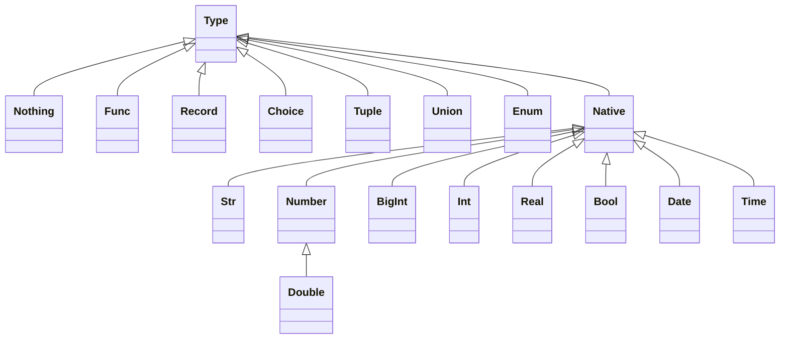

# HEXA 

Hexa is a Hexagonal Architecture Framework with element of Functional DDD.
   
Reading List:
* About Hexagonal Architecture and DDD read [here](https://herbertograca.com/2017/11/16/explicit-architecture-01-ddd-hexagonal-onion-clean-cqrs-how-i-put-it-all-together/).
* About Functional DDD [here](https://fraktalio.com/blog/) and [here](https://www.slideshare.net/slideshow/domain-modeling-made-functional-devternity-2022/254826776#1)
     

# Types 


## Declaring a type 
* with ```type``` keyword
## Native Types
### Str
### Int
### Real
### Bool
### Date
### Time


## Nothing Type
### Nothing vs. ```nil``` (no nil in managed code!)
## Type keys
* Types might have tags
* Tag might be used in Records or Choice construction as default key
* If (A | Nothing) is used type construction and A has a tag then the tag might be used as a default key
* If type has a tag then it might be used as implementation param name
## Record Type
### Items 
* all items are types with keys 
* recod constructor will automatically 
### Records Constraints 
### Records Composition ```+``` 
## Choice Type
### Records and Choices Composition ```+```
## Union Type
### ```|``` operator 
## Tuple Type
### ```*``` operator
## List Type 
### Items 
### Prefix Items
### Constraints
## Func Type
#### ```>>``` operator 


## Types operations

```Type1 | Tupe2```  &rarr; ```Union[Type1, Type2]```

```Union[Type1, Tupe2] | Type3```  &rarr; ```Union[Type1, Type2, Type3]```

```Union[Type1, Tupe2] | Union[Type3, Tupe4]```  &rarr; ```Union[Type1, Type2, Type3, Type4]```

```Type1 * Type2```  &rarr; ```Tuple[Type1, Type2]```

```Tuple[Type1, Type2] * Type3```  &rarr; ```Tuple[Type1, Type2, Type3]```

```Tuple[Type1, Type2] * Tuple[Type3, Type4]```  &rarr; ```Tuple[Type1, Type2, Tuple[Type3, Type4]]```

```Tuple[Type1, Type2] & Tuple[Type3, Type4]```  &rarr; ```Tuple[Type1, Type2, Type3, Type4]```

```Record[a:..., b:...] + Record[c:..., d:...]```  &rarr; ```Record[a:..., b:..., c:..., d:....]```

```Choice[a:..., b:...] + Choice[c:..., d:...]```  &rarr; ```Choice[a:..., b:..., c:..., d:....]```

```Record[a:..., b:...] + Choice[c:..., d:...]```  &rarr; ```Union[Record[a:..., b:...,c:...], Record[a:..., b:...,d:...]]```

```Record[a:..., b:...] + Unin[Record[c:...],Record[d:...]]```  &rarr; ```Union[Record[a:..., b:...,c:...], Record[a:..., b:...,d:...]]```


```Func1(...) & Func2(...)```  &rarr; ```Func2(Func1(...))```

```Type1 >> Type2 ``` &rarr; ```Func[Type1, Type2]```

## Type annotation 
* ```title```
* ```doc```
* ```tag``` - each type might have many tags
* ```id``` - kind of "always uniq" tag.
```ruby
class TestScope < Hexa::Scope
  
end
```

## Custom Types 
### Native 
```ruby 
class TestType < Hexa::NativeType 
  builder do
    def path(path)
        
    end   
  end
  
  coerce String do
    # ... 
  end
  
  scope_helpers do
    def file
      TestType.prototype 
    end  
  end
end

class MyScope < Hexa::Scope 
  include TestType.scope_helpers 
end 
```

# Scopes  
## Imports
## Exports
* It will export everithin from the export list 
* calling ```export``` will create an export list and will freeze the scope
* it will not be possible to inherit frozen scope 
* All constans in the scope will be added to the export list automatically 
## Initialization 
* ```init``` keyword 
## Instantiation
## Constants
* Constans are special kind of types - singletone types. I.e. type which might have only one value 

# Generics

* ```Typ``` for generic parameter
* ```Sub``` for generic parameter substitution


# Functional Compositions

## Monads
### Success
### Failure
### Skip
### Maybe
### Panic

## Pipeline
### Pipe requires native implementation at least for now

## Composers 
### Sequence 
```ruby
class MyScope < Hexa::Scope
  input = init str * str 
  
  pipe_func = type str * input >> str

  pipeline str >> str, :forward do |inp|
    pipe inp * input >> str, :one # pipe method will create a function with implementation method(:one)
    pipe pipe_func, :two
    pipe pipe_func, :three
    pipe pipe_func, :four  
  end
  
  pipeline str >> str, :backward do
    pipe pipe_func, :four
    pipe pipe_func, :three
    pipe pipe_func, :two
    pipe pipe_func, :one
  end
 
  def one(str, inp)
    str + ":f1[#{inp.join(',')}]"
  end
  
  def two(str, inp)
    str + ":f2[#{inp.join(',')}]"
  end

  def three(str, inp)
    str + ":f3[#{inp.join(',')}]"  
  end
  
  def four(str, inp)
    str + ":f4[#{inp.join(',')}]"
  end
  
  export(:forward, backward:) # at the moment of export we will check that all implementations are in place 
end

test = MyScope.new('aaa', 'bbb')

test.forward # return result, nil if nothing,  and exception on error 
test.backward

test.call(:forward) # returns monadic value 
test.call(:backward)

test.to_proc(:forward)  # returns result and exception if not result 
test.to_proc(:backward)

test.to_proc(:forward, false)  # returns monadic value 
test.to_proc(:backward, false)  

```


MyPackage::HelloWorld.call


### All Of, Some Of, One Of, Any Of  
Result a Tuple (for tuple input) or a Record (for record input)

```ruby
  pipeline str >> str do |str|
    split do
      pipe str >> maybe(Event1), :native_impl_1 # here can be eiter function of func type + native implementation 
      pipe str >> maybe(Event2), :native_impl_2
      pipe str >> maybe(Event3), :native_impl_3
      pipe str >> maybe(Event4), :native_impl_4
    end

    # result is a tuple of monads
    # result is a tuple of monads
    join  # options: all_or_error, all_or_error
  end 
```

```ruby
class UserAccount < Hexa::Domain 
  user_data = { first_name: str, last_name: str }

  CreateUser = type command :create_user, **user_data # command :name, record[...params]
      
  User = type entity :user, str, **user_data  # entity :name, id, record[... attributes] 
  Account = type entity :account, str, balance: int
  Order = type entity :order, str, date: date, amount: int

  AccWasCreaded = type event
  AccWasFunded = type event
  AccWasWithdrawn = type event
   
  AccountEvents = AccWasCreaded | AccWasFunded | AccWasWithdrawn
   
  Ports = init record get_user: CreateUser >> io(User),
                      put_user: User >> io,
                      get_account_events: CreateUser >> io(AccountEvents.list),
                      put_account_events: AccountEvents >> io,
                      get_order: CreateUser >> io(Order),
                      put_order: Order >> io,
                      user_id_provider: Nothing >> io(str)
   
  repository Ports[:get_user], Ports[:put_user], Ports[:get_account_events], Ports[:put_account_events],
             Ports[:get_order], Ports[:put_order] # this will generate a func with a native implementation aka proc 

  UserEvents = type Event1 | Event2 | Event3 | Event4

  # decider builder 
  decide CreateUser * Ports[:user_id_provider] >> result(UserEvents) do |command, id_provider| 
    # we are inside pipeline. after params substitution the 1-st step of th pipeline always starts with Nothing.
    pipe id_provider >> str, &:call
    split do
      pipe command * id >> maybe(Event1), :native_impl_1
      pipe command * id >> maybe(Event2), :native_impl_2 
      pipe command * id >> maybe(Event3), :native_impl_3
      pipe command * id >> maybe(Event4), :native_impl_4
    end
    join # convert tuple to a list?
  end
 
  evolve Account * AccBalanceWasUpdated >> Account do |account, event|
    pipe account * event >> Account do |account, event|
      account.mutate { |x| x.balance = event.balance }
    end
  end
  
  export # export here is overloaded. it will  
end
```
### Pipeline blocks
* Split
* Join 

### Any Of 
Result is a Union  (for tuple input) or a Choice (for record input)
If all have the same type then output will be this type without union

### Join

### Repeater - Until
### Repeater - While


## ConnectionExit
### Bind
### Map
### Tee
### Buffering 
### Generators
Repeater + Buffering?


## Error Handling 
### Panics vs Failures 
### Deferred 
### Compensate
Any Of 
  - Branch : x -> Maybe[y]
  - Compensate : x -> Success[y] (returns success only)


```ruby
class Accounting < Hexa::Domain 
  Cents = type int :cents  
  
  MainClaim = type record.wip
  
  SideClaim = type record.wip 
  
  CreditorBounce = type record.wip
  
  CreditorPayment = type record.wip
  
  CreditorClaim = type record main_claim: MainClaim,  side_claims: SideClaim.list, 
                              bounces: CreditorBounce.list, payments: CreditorPayment.list
  
  CollectionFee = type record.wip

  CollectionPayment = type record.wip

  CaseFile = type record claims: CreditorClaim.list, fees: CollectionFee.list, payments: CollectionPayment.list
end
```


* Type keyword seals the type
* Type keyword just copies everithin which the variable has at the moment to a new type variable
* Only sealed type can be used in function, choices, tupes, lists, maps, etc  
* Type which defines constrains is a prototype. Special keyword for a prototype?


### Example!

Putting external parameters to validators 

```ruby 
class InstallmetnPlans < Hexa::Domain
  currency = type enum(:usd, :eur, :chf)
  input = init record(supported_currencies: currency.list, current_date: date) 
  
  earliest_date = const input[:current_date]

  latest_date = const(input >> date) { |x| x[:current_date] + 1.day }
  
  supported_currencies = const(input >> currency.list) { |x| x[:supported_currencies] } # short cut 
  
  CaseFileId = type str(:case_file_id).wip
  
  Cents = type int(:cents, gt: 100)
  Currency = type enum.key(:currency).of(supported_currencies)
  Amount = type record(:amount, Cents, Currency)

  CreateInstallmentPlan = type command(:create_installmetn_plan, 
                                       CaseFileId, 
                                       Amount, 
                                       start_date: date(gt: earliest_date, lte: latest_date)
  
  InstallmetnPlanWasCreated = event.wip
  
  decide CreateInstallmentPlan >> list(InstallmetnPlanWasCreated) do |command|
    # ... 
  end
  
  export   
end 

ip_scope =  InstallmetnPlans.new(%w[usd eur], Date.today)
```


