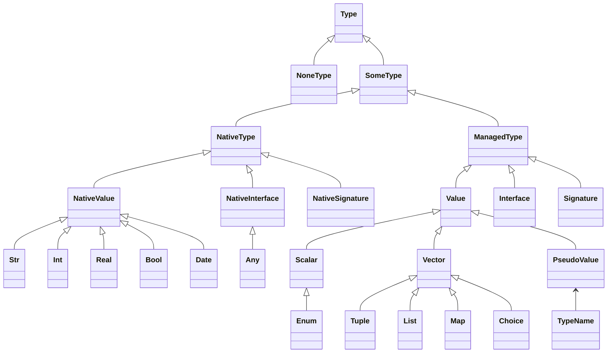

# HEXA 

Hexa is a Hexagonal Architecture Framework with element of Functional DDD.
   
Reading List:
* About Hexagonal Architecture and DDD read [here](https://herbertograca.com/2017/11/16/explicit-architecture-01-ddd-hexagonal-onion-clean-cqrs-how-i-put-it-all-together/).
* About Functional DDD [here](https://fraktalio.com/blog/) and [here](https://www.slideshare.net/slideshow/domain-modeling-made-functional-devternity-2022/254826776#1)


## Types



### Standard types
* __str__
* __int__
* __real__
* __bool__
                          

## Custom native types definition 
```ruby 
class MyScope < Hexa::Scope
  Re = native_value Regexp 
end
```

## Type casting 
```ruby 
class MyScope < Hexa::Scope
  Re = native Regexp
  
  cast str >> Re % :invalid!  { |str| Regexp.new(str) rescue :invlalid! }
  
  Arr = native Array # creates a scalar type 
  
  cast native(Enumberable) >> Arr &:to_a 
  
  Hsh = native Hash # creates a scalar type 
  
  case native(Enumberable) >> Hsh { |src| src.map { |k,v| [k,v] }.to_h }  
end
```

## Constants
```ruby 
class MyScope < Hexa::Scope
  MyName = str.const("Dima") 
end
```

## Maybe 
```ruby 
class MyScope < Hexa::Scope
  Re = native Regexp 
  pattern = fn Re * str >> ok % :invalid!  { |re, s| s ~= re ? true : :invalid! }
  
  Email = str.maybe & pattern[/^[\w-\.]+@([\w-]+\.)+[\w-]{2,4}$/]
end
```

## Enums  
```ruby 
class MyScope < Hexa::Scope
  Colors = enum white: 'W', black: 'B'  
end
``` 

## Tuples 
```ruby 
class MyScope < Hexa::Scope
  Colors = enum white: 'W', black: 'B'  
  Ranks = enum pawn: 'P', nkight: 'Kn', bishop: 'B', tour: 'T', qween: 'Q', king: 'K'
  Piece = Rank * Color
  
  white_bishop = Piece.const('B', 'W')
end
``` 

## Functions
```ruby 
class MyScope < Hexa::Scope
  add = fn :add, int * int >> int { |x, y| x + y } 
end
```

### Signatures
... TBD ...

### Methods
* methods are just a functions where the target object is first in the tuple

```ruby 
class TestScope < Hexa::Scope 
  FirstName = str & min_len[2]
  LastName = str & min_len[2]
  Email = str
  
  User = FirstName * LastName * Email.list 
     
  fn :full_name, User >> str { |u| "#{u.first_name.upcase} #{u.last_name.upcase}" }
  
  fn to_s: User >> str { |u| "#{u.full_name} #{u.email}" }  # which style is better? 
end 

### Definition options 
* Block 
* Collable 
* method 
* class_method 
```

## Constraints(aka Invariants)
```ruby 
class MyScope < Hexa::Scope
  Re = type Regexp 
  pattern = fn :pattern, Re * str >> ok % :invalid! { |re, s| s ~= re ? true : :invalid! }
  
  Email = str & pattern[/^[\w-\.]+@([\w-]+\.)+[\w-]{2,4}$/]
end

## Key-Value pairs 
```ruby 
class MyScope < Hexa::Scope
  User = str[:first_name] * str[:last_name]
end
```

or better 

```ruby 
class MyScope < Hexa::Scope
  FirstName = str[:first_name] & min_len[2]
  LastName = str[:last_name] & min_len[2]
  User = FirstName * LastName
end
```

## Choices 

```ruby 
class MyScope < Hexa::Scope
  FirstName = str[:first_name] & min_len[2]
  LastName = str[:last_name] & min_len[2]
  Person = FirstName * LastName
  
  UserOrAdmin = Person[:user] | Person[:admin]
end
```

or 

```ruby 
class MyScope < Hexa::Scope
  FirstName = str[:first_name] & min_len[2]
  LastName = str[:last_name] & min_len[2]
  Role[:role] = str.const('admin') | str.const('user')
  
  UserOrAdmin = FirstName * LastName * Role 
end
```


## Lists 

```ruby 
class MyScope < Hexa::Scope
  FirstName = str[:first_name] & min_len(2)
  LastName = str[:last_name] & min_len(2)
  Email = str[:email]
  
  User = FirstName * LastName * Email.list # by default it will have a name :emails  
end
```

## Maps 

... TBD ...


## Types Composition
```ruby 
class TestScope < Hexa::Scope 
  Email = str[:email] & pattern[/^[\w-\.]+@([\w-]+\.)+[\w-]{2,4}$/]
  PhoneNumber = str[:phone]
  ContactInformation = Email * PhoneNumber.maybe  
  
  Person = str[:first_name] * str[:last_name] 
  Company = str[:company_name] * str[:tax_number]
      
  Customer = (Person | Company) + ContactInformation + str.list[:tags].maybe   
end 
```

## Scope arguments 
```ruby 
class TestScope < Hexa::Scope   
  max_amount = init int[:max_amount] 
  min_amount = init int[:min_amount]
end 
```

## Curring function 
```ruby 
class TestScope < Hexa::Scope   
  gt = fn int * int >> ok % err(:less, int) { |base, x| x > base ? true : [:less, base] } 
  gt5 = gt[5]
  gt10 = gt[10]
  
  seven = int.const(7)
  gt_seven = gt[seven]
end 
```

## Scope constant expressions 
```ruby 
class TestScope < Hexa::Scope 
  args = init int[:max_amount]  
  gt = fn int * int >> bool { |base, x| x > base } 
  
  gt_max_amount = gt[args[:max_amount]]
  
  flag = calc gt_max_amount[100]
end 
```

## Scope State 
```ruby 
class TestScope < Hexa::Scope 
  counter_init = init int[:counter]
  
  counter = state counter_init  
  
  export fn :increment, counter >> int * counter do |counter|
    [counter + 1, counter + 1]
  end
end 
```

## Annotations 
* Annotation can be added for every type like
```yaml
scope:
  desc:
    # Accounting Context
    ## Entities 
    <%= key :user %>
    
    ## Commands 
    <%= key :creat_user %>
  keys:    
    user:
      desc: > 
        ### User 
        
        This text is in markdown format 

        <%= all_keys %>
      keys:
        first_name: User first name 
        last_name: User last name 
        email: User Email
    create_user:
      desc: >
        ### Create User Command
        <%= all_keys %>

```
```ruby

class UserAccount < Hexa::Domain
  User =  str[:name] * str[:email]
  
  extend Implementations
  
  export_default pipe str >> str do
    apply :one
    apply :two
    apply :three
  end
end
                        

class UserAccount < Hexa::Domain
  module Implementations
    def one(str)
      "one: #{str}"  
    end
    
    def two
      "two: #{str}"
    end

    def three
      "three: #{str}"
    end
  end
end

```


# Monads

* Success (Result)
* Failure
* Skip
* Maybe
* Panic
* IO

## In Pipelines
* if calculation get "infected with a monad once" it will become with this monad always. 
* there is no way to get reed of a monad


# Functional Compositions


# Pipeline
* ```pipeline``` keyword 
## Pipes 
* requires native implementation
  - ~symbol~ means class method. In this case seal  
  - ~block~ block is an implemenation 
* can take as 1-st parameter:
  - function type (has to match previos and next pipe)
  - just output type. (input type will be inferred from the previous pipe output)
  - noting (output type will be the same as input and input will be in inferred from the prev. pipe output)
* first pipe has to be a constructor function (i.e. all it's inputs are curried either from constants, 
  or form constructors, or from pipeline input parameters)
* last pipe output has to match pipeline output type 

## Composers 
### Pipelines inside pipelines 
```ruby
class MyScope < Hexa::Scope
  input = init str

  # & operator
  export_default pipe :forward, str >> str  do |inp|
    apply :one, inp * input >> str # pipe method will create a function with implementation method(:one)
    apply :two #input and output type will be inferred automatically  
    apply :three
    apply :four  
  end

  # * operator 
  export pipe :backward, str >> str do |inp|
    apply :four, inp * input >> str
    apply :three
    apply :two
    apply :one
  end
  
  # + operator 
  export all_of :many, str >> auto do |inp|
    apply :four, inp >> str
    apply :three, inp >> str
    apply :two, inp >> str
    apply :one, inp >> str
  end
 
  def self.one(str, inp)
    str + ":f1[#{inp.join(',')}]"
  end
  
  def self.two(str, inp)
    str + ":f2[#{inp.join(',')}]"
  end

  def self.three(str, inp)
    str + ":f3[#{inp.join(',')}]"  
  end
  
  def self.four(str, inp)
    str + ":f4[#{inp.join(',')}]"
  end
end

class MyScopeAlternativeSyntax < Hexa::Scope
  input = init str * str
  
  one = fn :one, str * input >> str
  two = fn :two, str * input >> str
  three = fn :three, str * input >> str
  four = fn :four, str * input >> str

  export_default :forward, one & two & three & four

  export :backward, one * two * three * four

  export :many, one + two + three + four

  def self.one(str, inp)
    str + ":f1[#{inp.join(',')}]"
  end

  def self.two(str, inp)
    str + ":f2[#{inp.join(',')}]"
  end

  def self.three(str, inp)
    str + ":f3[#{inp.join(',')}]"
  end

  def self.four(str, inp)
    str + ":f4[#{inp.join(',')}]"
  end
end

test = MyScope.new('aaa', 'bbb')

test.forward # return result, nil if nothing,  and exception on error 
test.backward

test.call(:forward) # returns monadic value 
test.call(:backward)

test.to_proc(:forward)  # returns result and exception if not result 
test.to_proc(:backward)

test.to_proc(:forward, false)  # returns monadic value 
test.to_proc(:backward, false)  

```

```ruby
class UserAccount < Hexa::Domain 
  aggregate str[:user_id] do |id|
    user_data = str[:first_name] * str[:last_name]

    create_command create_user: user_data

    entity order: date[:date] * int[:amount]
    
    root user: user_data + entity[:order].list,  
         account: int[:balance].tuple
    
    event account_was_created: int[:balance].tuple, 
          account_was_funded: date[:date] * int[:amount],
          user_was_created: user_data
    
    decide :create_user, id, ev: %i[user_was_created account_was_created] do |cmd, new_id|
      [
        [:event, :user_was_created, { user_id: new_id, **cmd[:params] }], 
        [:event, :account_was_created, { user_id: new_id, balance: 0 }]
      ]  
    end
    
    evolve :account, :account_was_funded do |account, event|
      account.to_h.merge(account[:amount] + event[:params][:amount])
      
      # alternative with patch syntax
      account.patch(amount: account[:amount] + event[:params][:amount])
    end
  end
end
```
### Composition keywords 
* pipe (&)
* compose (*)
* stack (+)
* eather 
* repeat 
* apply (func name and/or implementation)

```ruby
class Accounting < Hexa::Domain 
  Cents = int[:cents].wip 
  
  MainClaim = entity.wip  
  
  SideClaim = entity.wip 
  
  CreditorBounce = entity.wip
  
  CreditorPayment = entity.wip
  
  CreditorClaim = MainClaim * SideClaim.list * CreditorBounce.list * CreditorPayment.list # plural key will be automatically inflected
  
  CollectionFee = entity.wip

  CollectionPayment = entity.wip

  CaseFile = CreditorClaim.list * CollectionFee.list * CollectionPayment.list
end
```


### Example!

Putting external parameters to validators 

```ruby 
class InstallmetnPlans < Hexa::Domain
  AllCurrencies = enum :usd, :eur, :chf
  input = init AllCurrencies.list[:supported_currencies] * date[:current_date] 
  
  latest_date = fn input[:current_date] >> date { |x| x + 1.day }
  
  CaseFileId = str[:case_file_id].wip
  
  Cents = int[:cents] & gt[0]
  
  Currency = AllCurrencies[:currency] & include[input[:supported_currencies]] # constraint on enum 
  Amount = (Cents * Currency).key(:amount)
  
  InstallmentPlanData = CaseFileId * Amount * (date[:start_date] & gtd[input[:current_date]])
  
  InstallmentPlan = Amount * date[:date]  

  CreateInstallmentPlan = command :create_installment_plan, CaseFileId.tuple + InstallmentPlan 
  
  InstallmetnPlanWasCreated = event[:installment_plan_was_created].wip
  
  factory input >> InstallmentPlan 
  
  decide CreateInstallmentPlan * InstallmetnPlan >> InstallmetnPlanWasCreated.list do |command, state|
    # ... 
  end
  
  evolve InstallmetnPlanWasCreated * InstallmetnPlan >> InstallmetnPlan do |event, state|  
  seal   
  
  react InstallmetnPlanWasCreated * InstallmetnPlan >> Nothing do 
  end
end 

ip_scope =  InstallmetnPlans.new(%w[usd eur], Date.today)
```

# fDDD
## Aggregate
## Entity 
### Entity Mutator 
## Repository 
## Factory 
## Event 
## Command 
## Notification 
## Query 
## Decide
## Evolve
## React 
## Saga

```ruby
  repository Ports[:get_user], Ports[:put_user], Ports[:get_account_events], Ports[:put_account_events],
             Ports[:get_order], Ports[:put_order] # this will generate a func with a native implementation aka proc 


Ports = init tuple get_user: UserId >> io(User),
                     get_new_user_mock: CreateUser >> io(NewUserMock),
                     put_user: User >> io,
                     get_account_events: UserId >> io(AccountEvents.list),
                     put_account_events: AccountEvents >> io,
                     get_order: UserId >> io(Order),
                     put_order: Order >> io


decide CreateUser * id >> UserEvents.list, pipe do |cmd, user_mock|
  stack do
    apply :event_1, cmd[:command] * user_mock[:id] >> maybe(Event1)
    apply :event_2, cmd[:command] * user_mock[:id] >> maybe(Event2)
    apply :event_3, cmd[:command] * user_mock[:id] >> maybe(Event3)
    apply :event_3, cmd[:command] * user_mock[:id] >> maybe(Event4)
  end

  apply :to_list
  apply :compact # removes all maybe 
end
```


