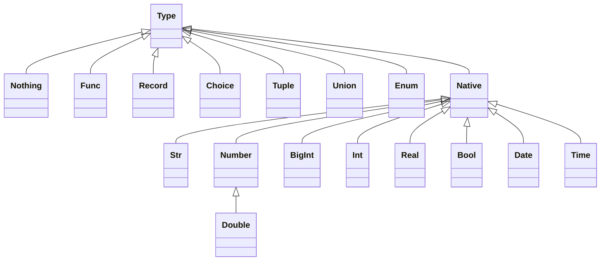

# HEXA 

Hexa is a Hexagonal Architecture Framework with element of Functional DDD.
   
Reading List:
* About Hexagonal Architecture and DDD read [here](https://herbertograca.com/2017/11/16/explicit-architecture-01-ddd-hexagonal-onion-clean-cqrs-how-i-put-it-all-together/).
* About Functional DDD [here](https://fraktalio.com/blog/) and [here](https://www.slideshare.net/slideshow/domain-modeling-made-functional-devternity-2022/254826776#1)
     

# Types 


             
## Native Types
### Str
### Int and BigInt
### Real and Double
### Bool
### Date and Time
### Custom Native Type
## None Type
### None vs. ```nil```
## Record Type
### Attributes  
### Inheritance 
### Records Constraints 
### Records Concatenation ```&``` 
## Choice Type
### Records and Choices Concatenation ```&```
## Union Type
### ```|``` operator 
## Tuple Type
### ```*``` operator
## List Type 
### Items 
### Prefix Items
### Constraints 
### Inheritance 
## Func Type
#### ```>>``` operator 

## Types operations

```Type1 | Tupe2```  &rarr; ```Union[Type1, Type2]```

```Union[Type1, Tupe2] | Type3```  &rarr; ```Union[Type1, Type2, Type3]```

```Union[Type1, Tupe2] | Union[Type3, Tupe4]```  &rarr; ```Union[Type1, Type2, Type3, Type4]```

```Type1 * Type2```  &rarr; ```Tuple[Type1, Type2]```

```Tuple[Type1, Type2] * Type3```  &rarr; ```Tuple[Type1, Type2, Type3]```

```Tuple[Type1, Type2] * Tuple[Type3, Type4]```  &rarr; ```Tuple[Type1, Type2, Tuple[Type3, Type4]]```

```Tuple[Type1, Type2] & Tuple[Type3, Type4]```  &rarr; ```Tuple[Type1, Type2, Type3, Type4]```

```Record[a:..., b:...] & Record[c:..., d:...]```  &rarr; ```Record[a:..., b:..., c:..., d:....]```

```Choice[a:..., b:...] & Choice[c:..., d:...]```  &rarr; ```Choice[a:..., b:..., c:..., d:....]```

```Record[a:..., b:...] & Choice[c:..., d:...]```  &rarr; ```Union[Record[a:..., b:...,c:...], Record[a:..., b:...,d:...]]```

```Func1(...) & Func2(...)```  &rarr; ```Func2(Func1(...))```

```Type1 >> Type2 ``` &rarr; ```Func[Type1, Type2]```


# Packages 
## Imports
## Exports
## Initialization and Implementation 
## Inheritance 
## Instantiation
## Abstract Types
## Singletons

# Generics

* ```Typ``` for generic parameter
* ```Sub``` for generic parameter substitution


# Functional Compositions

## Monads
### Success
### Failure
### Skip
### Maybe
### Panic

## Composers 
### Sequence 
```ruby
class MyScope < Hexa::Scope
  input = init str * str 
  # this will return autogenerated const function with a default impl
  # also will generate a constructor 
  
  pipe_func = type str * input >> str 
  
  # if function is const then it has to be implemented
  one = const pipe_func 
  two = const pipe_func
  three = const pipe_func
  four = const pipe_func
  
  forward = const pipe.map(one).map(two).map(three).map(four)
  backward = const four & three & two & one
  
  a = const forward.curry(input)  # Nothing >> Str. it's already implemented 
  b = const input >> str          # Nothing >> Str
  
  # six = const a * b * str >> promise[maybe[str]]
  six = const a * b * str >> str
  
  implement one
  def one(str, inp)
    str + ":f1[#{inp.join(',')}]"
  end
  
  implement two  
  def two(str, inp)
    str + ":f2[#{inp.join(',')}]"
  end

  implement three
  def three(str, inp)
    str + ":f3[#{inp.join(',')}]"  
  end

  implement four
  def four(str, inp)
    str + ":f4[#{inp.join(',')}]"
  end
  
  implement b
  def calculate_b(inp)
    "Hello #{inp}"  
  end
  
  implement six
  def calculate(a, b, c)
    "a:#{a} b:#{b} c:#{c}"
  end
  
  export(forward, forward: , backward:)
end
```


MyPackage::HelloWorld.call


### All Of 
Result a Tuple (for tuple input) or a Record (for record input)

```
   AllOf[a: f1, b: f2, c: f3] - all of. result Maybe[record]
   AllOf[f1, f2, f3] - all of. result: Maybe[f1.result_type, f2.result_type, ]      
```

### Some Of
```
   SomeOf[a: f1, b: f2, c: f3] - all of. result Maybe[record]
   SomeOf[f1, f2, f3] - all of. result: Maybe[f1.result_type, f2.result_type, ]      
```
### One Of
Result is a Union  (for tuple input) or a Choice (for record input)
If all have the same type then output will be this type without union

```
   OneOf[a: f1, b: f2, c: f3] - all of. Maybe[Choice[a: f1, b:]]
   OneOf[f1, f2, f3] - all of. result: Maybe[Union[f1.result_type, f2.result_type]] 
```

```   
   class Lists < Hexa::Package
     Reduce = List[Typ[:typ]] >= Typ[:typ]
     Sum = Reduce[].sigletone { |list| list.collect(&:+) }     
   end   
```

``` 
   class Hexa::Package
     Monad = Record[]
     Success = Monad[result: Typ[]]
     Failure = Monad[]
     Maybe = Success | Failure
   end 
``` 

### Any Of 
Result is a Union  (for tuple input) or a Choice (for record input)
If all have the same type then output will be this type without union

### Join

### Repeater - Until
### Repeater - While


## ConnectionExit
### Bind
### Map
### Tee
### Buffering 
### Generators
Repeater + Buffering?


## Error Handling 
### Panics vs Failures 
### Deferred 
### Compensate
Any Of 
  - Branch : x -> Maybe[y]
  - Compensate : x -> Success[y] (returns success only)


```ruby
class NamingOptions < Hexa::Domain
  positive_int = type int[gt: 5] # positive int type without key
  cents = type int[:cents, gt: 5] # positive int with key => shortcut for type :cents int.
  t1 = type positive_int[:cents] * cents # => errors: 2 times the same key
  t2 = type positive_int[:cents] * cents[:other_cents] # => {cents: ..., other_cents: ...}
end
```

```ruby
class Accounting < Hexa::Domain 
  Cents = type int[:cents]  
  
  MainClaim = type record.wip
  
  SideClaim = type record.wip 
  
  CreditorBounce = type record.wip
  
  CreditorPayment = type record.wip
  
  CreditorClaim = type MainClaim[:main_claim] * SideClaim.list[:side_claims] *
    CreditorBounce.list[:bounces] * CreditorPayment.list[:payments]
  
  CollectionFee = type record.wip

  CollectionPayment = type record.wip

  CaseFile = type record[claims: CreditorClaim.list, fees: CollectionFee.list, 
                        payments: CollectionPayment.list]
end
```


* Type keyword seals the type
* Type keyword just copies everithin which the variable has at the moment to a new type variable
* Only sealed type can be used in function, choices, tupes, lists, maps, etc  
* Type which defines constrains is a prototype. Special keyword for a prototype?


### Example!

Putting external parameters to validators 

```ruby 
class InstallmetnPlans < Hexa::Domain
  currency = type enum[:usd, :eur, :chf]
  input = init currency.list[:supported_currencies] * date[:curret_date] 
  
  earliest_date = const input >> date 
  implement current_date { |x| x[:current_date] }

  latest_date = const input >> date
  implement current_date { |x| x[:current_date] + 1.day }
  
  supported_currencies = const(input >> currency.list) { |x| x[:supported_currencies] } # short cut 
  
  CaseFileId = type str[:case_file_id].wip
  
  Cents = type int[:cents, gt: 100]
  Currency = type enum[:currency][supported_currencies]
  Amount = Cents * Currency
  
  command_params = CaseFileId * Amount * date[:start_date, gt: earliest_date, lte: latest_date]
  CreateInstallmentPlan = command[:create_installmetn_plan] + command_params
  InstallmetnPlanWasCreated = event.wip
  
  installment_plan_events = 
  decide CreateInstallmentPlan >> list[InstallmetnPlanWasCreated]
end 

ip_scope =  InstallmetnPlans.new(%w[usd eur], Date.today)
```


