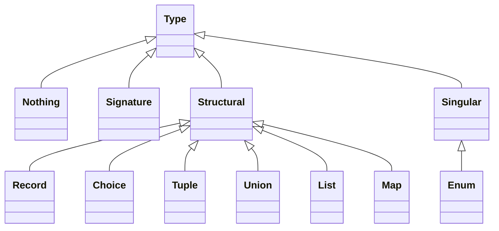

# HEXA 

Hexa is a Hexagonal Architecture Framework with element of Functional DDD.
   
Reading List:
* About Hexagonal Architecture and DDD read [here](https://herbertograca.com/2017/11/16/explicit-architecture-01-ddd-hexagonal-onion-clean-cqrs-how-i-put-it-all-together/).
* About Functional DDD [here](https://fraktalio.com/blog/) and [here](https://www.slideshare.net/slideshow/domain-modeling-made-functional-devternity-2022/254826776#1)


## Types
```ruby 
class MyScope < Hexa::Scope
  Re = type Regexp 
end
```




Standard types:
* __str__
* __int__
* __real__
* __bool__


## Constants 
```ruby 
class MyScope < Hexa::Scope
  MyName = const str "Dima" 
end
```

## Maybe 
```ruby 
class MyScope < Hexa::Scope
  Re = type Regexp 
  pattern = fn :pattern, Re * str >> bool { |re, s| s ~= re }
  
  Email = str.maybe & pattern[/^[\w-\.]+@([\w-]+\.)+[\w-]{2,4}$/]
end
```

## Enums  
```ruby 
class MyScope < Hexa::Scope
  Colors = enum white: 'W', black: 'B'  
end
``` 

## Tuples 
```ruby 
class MyScope < Hexa::Scope
  Colors = enum white: 'W', black: 'B'  
  Ranks = enum pawn: 'P', nkight: 'Kn', bishop: 'B', tour: 'T', qween: 'Q', king: 'K'
  Piece = Rank * Color
  
  white_bishop = const Piece, ['B', 'W']
end
``` 

## Functions
```ruby 
class MyScope < Hexa::Scope
  add = fn int * int >> int { |x, y| x + y } 
end
```


### Signatures
... TBD ...


## Constraints
```ruby 
class MyScope < Hexa::Scope
  Re = type Regexp 
  pattern = fn :pattern, Re * str >> bool { |re, s| s ~= re }
  
  Email = str & pattern[/^[\w-\.]+@([\w-]+\.)+[\w-]{2,4}$/]
end
```

## Key-Value pairs 
```ruby 
class MyScope < Hexa::Scope
  User = str[:first_name] * str[:last_name]
end
```

or better 

```ruby 
class MyScope < Hexa::Scope
  FirstName = str[:first_name] & min_len(2)
  LastName = str[:last_name] & min_len(2)
  User = FirstName * LastName
end
```

## Choices 

```ruby 
class MyScope < Hexa::Scope
  FirstName = str[:first_name] & min_len(2)
  LastName = str[:last_name] & min_len(2)
  Person = FirstName * LastName
  
  UserOrAdmin = Person[:user] | Person[:admin]
end
```

or 

```ruby 
class MyScope < Hexa::Scope
  FirstName = str[:first_name] & min_len(2)
  LastName = str[:last_name] & min_len(2)
  Role[:role] = (const str 'admin') | (const str 'user')
  
  UserOrAdmin = FirstName * LastName * Role 
end
```


## Lists 

```ruby 
class MyScope < Hexa::Scope
  FirstName = str[:first_name] & min_len(2)
  LastName = str[:last_name] & min_len(2)
  Email = str[:email]
  
  User = FirstName * LastName * Email.list[:emails] 
end
```

## Maps 

... TBD ...


## Methods 
* methods can't change the object. just read only 

```ruby 
class TestScope < Hexa::Scope 
  FirstName = str[:first_name] & min_len(2)
  LastName = str[:last_name] & min_len(2)
  Email = str[:email]
  
  User = FirstName * LastName * Email.list[:emails] 
     
  fn :full_name, User >> str { |u| |u| "#{u.first_name.upcase #{u.last_name.upcase}" }
  
  fn :to_s, User >> str { |u| "#{u.full_name} #{u.email}" } 
end 
```

## Types Composition
```ruby 
class TestScope < Hexa::Scope 
  Email = str[:email] & pattern[/^[\w-\.]+@([\w-]+\.)+[\w-]{2,4}$/]
  PhoneNumber = str[:phone]
  ContactInformation = Email * PhoneNumber.maybe  
  
  Person = str[:first_name] * str[:last_name] 
  Company = str[:company_name] * str[:tax_number]
      
  Customer = (Person | Company) + ContactInformation + str.list[:tags].maybe   
end 
```

## Scope arguments 
```ruby 
class TestScope < Hexa::Scope   
  args = init int[:max_amount].tuple 
end 
```

## Curring function 
```ruby 
class TestScope < Hexa::Scope   
  gt = fn int * int >> bool { |base, x| x > base } 
  gt5 = gt[5]
  gt10 = gt[10]
  
  seven = const int 7
  gt_seven = gt[seven]
end 
```

## Scope constant expressions 
```ruby 
class TestScope < Hexa::Scope 
  args = init int[:max_amount].tuple  
  gt = fn int * int >> bool { |base, x| x > base } 
  
  gt_max_amount = gt[args[:max_amount]]
  
  flag = calc gt_max_amount[100]
end 
```


## Annotations 
* Annotation can be added for every type like
```ruby
class UserAccount < Hexa::Domain 
  User = type record name: str, email: str
  
  doc User, "Hello World"
  doc User, :name, "Name"
  doc User, name: "Name", email: "Email" 
  
  doc User do 
    doc :name, "Hello"
    doc :world, "World"
  end
  
  Call = pipeline str >> str do
    pipe :one
    pipe :two
    pipe :three
  end
  
  doc :call do 
    doc "One"
    doc "Two"
    doc "Three"
  end
end

```
* It's better to keep annotations as a separate moule 
```ruby

class UserAccount < Hexa::Domain
  User = type record name: str, email: str

  Call = pipeline str >> str do
    pipe :one
    pipe :two
    pipe :three
  end

  include Implementations
  include Annotations  
  
  seal
end


class UserAccount < Hexa::Domain 
  # module Annotations
  #   extend Hexa::Patial 
  #  
  #   included do
  #     doc :user, "Hello World", name: "Name", email: "Email"
  #     doc :default, :items, ["One", "Two", "Three"]
  #   end
  # end
end

class UserAccount < Hexa::Domain
  module Implementations
    def one(str)
      "one: #{str}"  
    end
    
    def two
      "two: #{str}"
    end

    def three
      "three: #{str}"
    end
  end
end

```


# Monads

* Success (Result)
* Failure
* Skip
* Maybe
* Panic
* IO

## In Pipelines
* if calculation get "infected with a monad once" it will become with this monad always. 
* there is no way to get reed of a monad


# Functional Compositions


# Pipeline
* ```pipeline``` keyword 
## Pipes 
* requires native implementation
  - ~symbol~ means class method. In this case seal  
  - ~block~ block is an implemenation 
* can take as 1-st parameter:
  - function type (has to match previos and next pipe)
  - just output type. (input type will be inferred from the previous pipe output)
  - noting (output type will be the same as input and input will be in inferred from the prev. pipe output)
* first pipe has to be a constructor function (i.e. all it's inputs are curried either from constants, 
  or form constructors, or from pipeline input parameters)
* last pipe output has to match pipeline output type 

## Composers 
### Pipelines inside pipelines 
```ruby
class MyScope < Hexa::Scope
  input = init str * str 
  
  Forward = pipeline str >> str do |inp|
    pipe inp * input >> str, :one # pipe method will create a function with implementation method(:one)
    pipe :two  #input and output type will be inferred automatically  
    pipe :three
    pipe :four  
  end
  
  Backward = pipeline str >> str do |inp|
    pipe inp * input >> str, :four
    pipe :three
    pipe :two
    pipe :one
  end
 
  def one(str, inp)
    str + ":f1[#{inp.join(',')}]"
  end
  
  def two(str, inp)
    str + ":f2[#{inp.join(',')}]"
  end

  def three(str, inp)
    str + ":f3[#{inp.join(',')}]"  
  end
  
  def four(str, inp)
    str + ":f4[#{inp.join(',')}]"
  end
  
  seal Forward# at the moment of export we will check that all implementations are in place 
end

class MyScopeAlternativeSyntax < Hexa::Scope
  input = init str * str
  
  one = fn str * input >> str, :one
  two = fn str * input >> str, :two
  three = fn str * input >> str, :three
  four = fn str * input >> str, :four

  Forward = one & two & three & four

  Backward = one + two + three + four

  def one(str, inp)
    str + ":f1[#{inp.join(',')}]"
  end

  def two(str, inp)
    str + ":f2[#{inp.join(',')}]"
  end

  def three(str, inp)
    str + ":f3[#{inp.join(',')}]"
  end

  def four(str, inp)
    str + ":f4[#{inp.join(',')}]"
  end

  

  seal Forward  # at the moment of export we will check that all implementations are in place 
end

test = MyScope.new('aaa', 'bbb')

test.forward # return result, nil if nothing,  and exception on error 
test.backward

test.call(:forward) # returns monadic value 
test.call(:backward)

test.to_proc(:forward)  # returns result and exception if not result 
test.to_proc(:backward)

test.to_proc(:forward, false)  # returns monadic value 
test.to_proc(:backward, false)  

```


MyPackage::HelloWorld.call


### All Of, Some Of, One Of, Any Of  
Result a Tuple (for tuple input) or a Record (for record input)

```ruby
  pipeline str >> str do |str|
    split do
      pipe str >> maybe(Event1), :native_impl_1 # here can be eiter function of func type + native implementation 
      pipe str >> maybe(Event2), :native_impl_2
      pipe str >> maybe(Event3), :native_impl_3
      pipe str >> maybe(Event4), :native_impl_4
    end
    # result is a tuple of monads

    join  # options: all_or_error, all_or_error
  end 
```

```ruby
class UserAccount < Hexa::Domain 
  user_data = type record first_name: str, last_name: str

  CreateUser = type command + user_data # + means that command will concatenate all attributes from the record 
  
  UserId = type str 
  
  UserAggregate = type aggregate UserId # aggegate takes an id type as a parameter
      
  User = type entity(UserAggregate) + user_data # if entity takes an aggreagte as a key, then it becomes an aggregate 
                                                # root entity. each command has to have at least on aggregate root   
  Account = type entity UserAggregate, balance: int
  Order = type entity UserAggregate, date: date, amount: int

  AccWasCreaded = type event.wip
  AccWasFunded = type event.wip
  AccWasWithdrawn = type event.wip
   
  AccountEvents = type AccWasCreaded | AccWasFunded | AccWasWithdrawn
   
  Ports = init record get_user: UserId >> io(User),
                      put_user: User >> io,
                      get_account_events: UserId >> io(AccountEvents.list),
                      put_account_events: AccountEvents >> io,
                      get_order: UserId >> io(Order),
                      put_order: Order >> io,
                      user_id_provider: Nothing >> io(str)
   
  repository Ports[:get_user], Ports[:put_user], Ports[:get_account_events], Ports[:put_account_events],
             Ports[:get_order], Ports[:put_order] # this will generate a func with a native implementation aka proc 

  UserEvents = type Event1 | Event2 | Event3 | Event4

  # decider builder 
  decide CreateUser * Ports[:user_id_provider] >> result(UserEvents) do |command, id_provider| 
    # we are inside pipeline. after params substitution the 1-st step of th pipeline always starts with Nothing.
    pipe id_provider >> str, &:call
    split do
      pipe command * id >> maybe(Event1), :native_impl_1
      pipe command * id >> maybe(Event2), :native_impl_2 
      pipe command * id >> maybe(Event3), :native_impl_3
      pipe command * id >> maybe(Event4), :native_impl_4
    end
    join # convert tuple to a list?
  end
 
  evolve Account * AccBalanceWasUpdated >> Account do |account, event|
    pipe account * event >> Account do |account, event|
      account.mutate { |x| x.balance = event.balance }
    end
  end
  
  seal # export here is overloaded. it will  
end
```
### Pipeline blocks
* Split
* Join 

### Any Of 
Result is a Union  (for tuple input) or a Choice (for record input)
If all have the same type then output will be this type without union

### Join

### Repeater - Until
### Repeater - While


## ConnectionExit
### Bind
### Map
### Tee
### Buffering 
### Generators
Repeater + Buffering?


## Error Handling 
### Panics vs Failures 
### Deferred 
### Compensate
Any Of 
  - Branch : x -> Maybe[y]
  - Compensate : x -> Success[y] (returns success only)


```ruby
class Accounting < Hexa::Domain 
  Cents = type int.wip 
  
  MainClaim = type record.wip
  
  SideClaim = type record.wip 
  
  CreditorBounce = type record.wip
  
  CreditorPayment = type record.wip
  
  CreditorClaim = type record main_claim: MainClaim,  side_claims: SideClaim.list, 
                              bounces: CreditorBounce.list, payments: CreditorPayment.list
  
  CollectionFee = type record.wip

  CollectionPayment = type record.wip

  CaseFile = type record claims: CreditorClaim.list, fees: CollectionFee.list, payments: CollectionPayment.list
end
```


* Type keyword seals the type
* Type keyword just copies everithin which the variable has at the moment to a new type variable
* Only sealed type can be used in function, choices, tupes, lists, maps, etc  
* Type which defines constrains is a prototype. Special keyword for a prototype?


### Example!

Putting external parameters to validators 

```ruby 
class InstallmetnPlans < Hexa::Domain
  currency = type enum(:usd, :eur, :chf)
  input = init record supported_currencies: currency.list, current_date: date 
  
  latest_date = fn input >> date { |x| x[:current_date] + 1.day }
  
  CaseFileId = type str.wip
  
  Cents = type int gt: 100
  Currency = type currency.constraint(in: input[:supported_currencies]) # constraint on enum 
  Amount = type record cents: Cents, currency: Currency
  
  InstallmentPlanData = type record case_file_id: CaseFileId,  # validatrors can take constas/constructors and params 
                                    amount: Amount,
                                    start_date: date(gt: input[:current_date], lte: latest_date) 
  
  InstallmentPlan = type entity amount: Amount, date: Daye  

  CreateInstallmentPlan = type command 
  
  InstallmetnPlanWasCreated = event.wip
  
  factory input >> InstallmentPlan 
  
  decide CreateInstallmentPlan * InstallmetnPlan >> InstallmetnPlanWasCreated.list do |command, state|
    # ... 
  end
  
  evolve InstallmetnPlanWasCreated * InstallmetnPlan >> InstallmetnPlan do |event, state|  
  seal   
  
  react InstallmetnPlanWasCreated * InstallmetnPlan >> Nothing do 
  end
end 

ip_scope =  InstallmetnPlans.new(%w[usd eur], Date.today)
```

# fDDD
## Aggregate
## Entity 
### Entity Mutator 
## Repository 
## Factory 
## Event 
## Command 
## Notification 
## Query 
## Decide
## Evolve
## React 
## Saga


