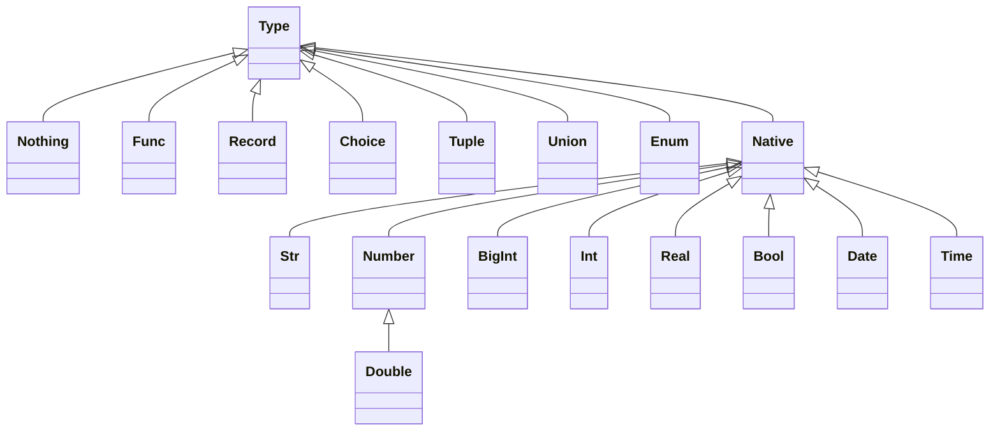

# HEXA 

Hexa is a Hexagonal Architecture Framework with element of Functional DDD.
   
Reading List:
* About Hexagonal Architecture and DDD read [here](https://herbertograca.com/2017/11/16/explicit-architecture-01-ddd-hexagonal-onion-clean-cqrs-how-i-put-it-all-together/).
* About Functional DDD [here](https://fraktalio.com/blog/) and [here](https://www.slideshare.net/slideshow/domain-modeling-made-functional-devternity-2022/254826776#1)
     

# Types 


             
## Native Types
### Str
### Int and BigInt
### Real and Double
### Bool
### Date and Time
### Custom Native Type
## None Type
### None vs. ```nil```
## Record Type
### Attributes  
### Inheritance 
### Records Constraints 
### Records Concatenation ```&``` 
## Choice Type
### Records and Choices Concatenation ```&```
## Union Type
### ```|``` operator 
## Tuple Type
### ```*``` operator
## List Type 
### Items 
### Prefix Items
### Constraints 
### Inheritance 
## Func Type
#### ```>>``` operator 

## Types operations

```Type1 | Tupe2```  &rarr; ```Union[Type1, Type2]```

```Union[Type1, Tupe2] | Type3```  &rarr; ```Union[Type1, Type2, Type3]```

```Union[Type1, Tupe2] | Union[Type3, Tupe4]```  &rarr; ```Union[Type1, Type2, Type3, Type4]```

```Type1 * Type2```  &rarr; ```Tuple[Type1, Type2]```

```Tuple[Type1, Type2] * Type3```  &rarr; ```Tuple[Type1, Type2, Type3]```

```Tuple[Type1, Type2] * Tuple[Type3, Type4]```  &rarr; ```Tuple[Type1, Type2, Tuple[Type3, Type4]]```

```Tuple[Type1, Type2] & Tuple[Type3, Type4]```  &rarr; ```Tuple[Type1, Type2, Type3, Type4]```

```Record[a:..., b:...] & Record[c:..., d:...]```  &rarr; ```Record[a:..., b:..., c:..., d:....]```

```Choice[a:..., b:...] & Choice[c:..., d:...]```  &rarr; ```Choice[a:..., b:..., c:..., d:....]```

```Record[a:..., b:...] & Choice[c:..., d:...]```  &rarr; ```Union[Record[a:..., b:...,c:...], Record[a:..., b:...,d:...]]```

```Func1(...) & Func2(...)```  &rarr; ```Func2(Func1(...))```

```Type1 >> Type2 ``` &rarr; ```Func[Type1, Type2].singletone```
```Type1 >= Type2 ``` &rarr; ```Func[Type1, Type2]```


# Packages 
## Imports
## Exports
## Initialization and Implementation 
## Inheritance 
## Instantiation
## Abstract Types
## Singletons

# Generics


# Functional Compositions

## Monads
### Success
### Failure
### Skip
### Maybe
### Panic

## Composers 
### Sequence 
```ruby
   f1 & ~f2 & f3 # -> Secqunce[f1, Tee[f2], f3]. Result Maybe[f3.oupput_type]

```


### All Of 
Result a Tuple (for tuple input) or a Record (for record input)

```
   AllOf[a: f1, b: f2, c: f3] - all of. result Maybe[record]
   AllOf[f1, f2, f3] - all of. result: Maybe[f1.result_type, f2.result_type, ]      
```

### Some Of
```
   SomeOf[a: f1, b: f2, c: f3] - all of. result Maybe[record]
   SomeOf[f1, f2, f3] - all of. result: Maybe[f1.result_type, f2.result_type, ]      
```
### One Of
Result is a Union  (for tuple input) or a Choice (for record input)
If all have the same type then output will be this type without union

```
   OneOf[a: f1, b: f2, c: f3] - all of. Maybe[Choice[a: f1, b:]]
   OneOf[f1, f2, f3] - all of. result: Maybe[Union[f1.result_type, f2.result_type]] 
   
   ListReducer = List[Typ[:typ]] >= Typ[:typ]
   
   ListSummator = ListReducer[].singletone   
   implement ListSummantor { |list| list.collect(&:+) }
   
   IntListSummator = ListSummantor[typ: Int]
   
   class Lists < Hexa::Package
     Reduce = List[Typ[:typ]] >= Typ[:typ]
     Sum = Reduce[].sigletone { |list| list.collect(&:+) }
     
   end
```

### Any Of 
Result is a Union  (for tuple input) or a Choice (for record input)
If all have the same type then output will be this type without union

### Join

### Repeater - Until
### Repeater - While


## ConnectionExit
### Bind
### Map
### Tee
### Buffering 
### Generators
Repeater + Buffering?


## Error Handling 
### Panics vs Failures 
### Deferred 
### Compensate
Any Of 
  - Branch : x -> Maybe[y]
  - Compensate : x -> Success[y] (returns success only)
   


